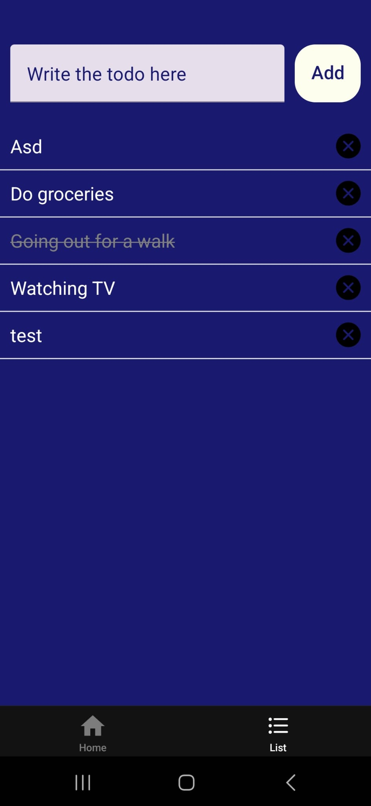

# Summary
To-Do List Application done with React Native, Expo, Three.JS and Jest entirely by myself.

# Features
## Fully interactive a to-do list functionality:
  - Asynchronous. Adding new to-dos seemlessly in an asynchronous way.
  - Markable. They can be crossed away just by tapping them.
  - Deletable. Includes a custom icon per to-do that allows the user to remove them.

## Extensive Unit Testing through Jest
 The app is implemented using best practices as each element is contained on their own script, which allows them to be throughly tested.
### Tests
 #### AddTab.js
- Button is working appropriately without text
- Button is working appropriately after adding text
 #### Display.js
- Renders the todos correctly
- Applies completed styles to completed todos
- Triggers onToggle when a todo is pressed
- Triggers onRemove with correct id when delete icon is pressed
- OnRemove is triggered with correct id

 #### Trigger.js
- Correct rendering

## Custom rotatable 3D Model loaded with Three.JS with an implemented loading icon and custom lighting.
- Extensive unit testing using Jest, 
- Navigation:
    - Tab Navigation with custom icons and colors.
    - Stack Navigation for other pages with custom headers.

